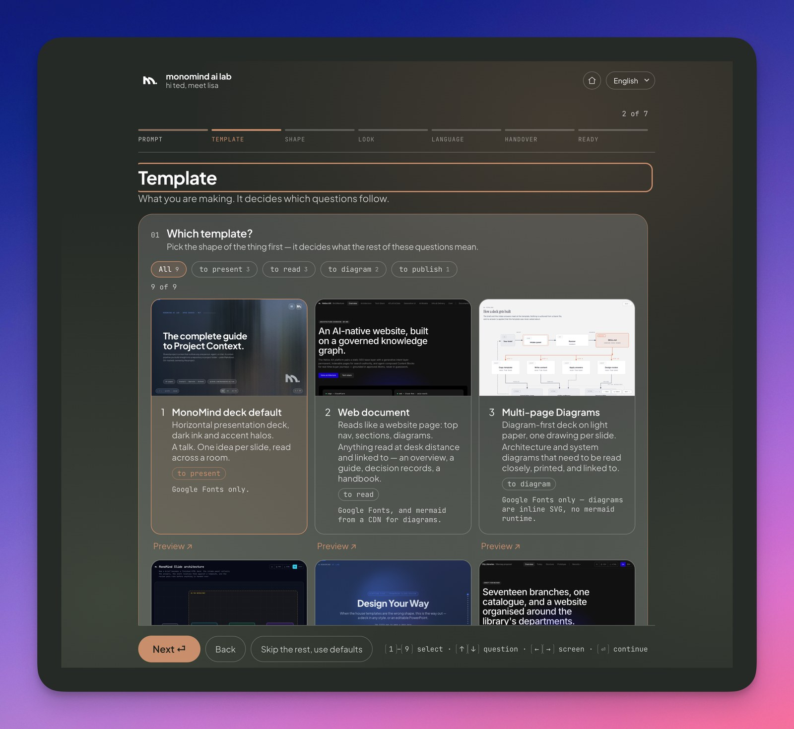
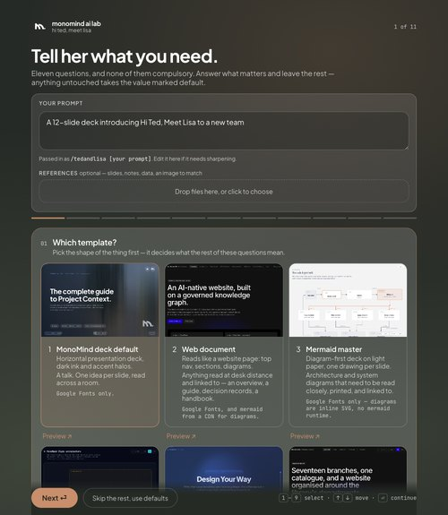

# Hi Ted, Meet Lisa

<p align="left">
  
</p>

> **Turn ideas into compelling slide decks — one standalone HTML file, no build step.**

Hi Ted, Meet Lisa is an agent skill that generates a finished, self-contained HTML
deck. You describe the deck; the agent asks what it cannot infer, builds from a
template, applies your answers, and hands you a single file you can open,
present, print, or email — then reviews it, inline or after delivery, whichever
you chose.

The design system is not improvised per deck. It ships in the repository as
templates: design tokens, a typographic scale, a component library, navigation,
and the language switch. The agent fills a template with content rather than
inventing a look each time — so two decks made months apart still look related.

Hi Ted, Meet Lisa is **agent-operated and human-readable**. People provide the
brief and answer a short visual intake; agents read the skill, build the deck,
and verify it. Every template is plain HTML and CSS that a person can open and
edit at any time.


---

## ✅ Start here

**No terminal? Start at the website.** [html.monomind.one](https://html.monomind.one)
is the whole front door in a browser: preview every template live, answer the
intake panel, and copy one paste-ready prompt for any coding agent — Claude
Code, Codex, Pi, OpenCode, Hermes, or anything else that reads a public URL.
Nothing to install.

Prefer it as a standing command? Install the plugin once — it carries all six
skills, and then they are six commands you have for good.

```sh
/plugin marketplace add monomind-ai-lab/hi-ted-meet-lisa
/plugin install hi-ted-meet-lisa@monomind
```

In Codex, the same two steps are one:

```sh
codex plugin marketplace add monomind-ai-lab/hi-ted-meet-lisa
```

**Using the Claude or ChatGPT app instead?** You can, but know what you give
up. Those sandboxes have no browser and no way to serve a port to you, so the
intake panel cannot open itself — you answer it at
[html.monomind.one/intake.html](https://html.monomind.one/intake.html) and
paste the payload back, and you watch a blank screen while the file is built
rather than the build itself. The plugin is the better experience by a
distance. If you still want it: those panels take a skill as a ZIP, one at a
time — Claude at *Customize → Skills → + → Create skill*, ChatGPT at
*Plugins → Skills → Create*. Build the bundles, then upload whichever you
want:

```sh
python3 scripts/build_skill_zips.py   # writes dist/lisa.zip and three more
```

Upload `lisa`; `lisa-lang` and `lisa-help` are worth a slot too — the first
layers languages onto a finished file with the same payload `lisa` carries,
the second is a few kilobytes because it answers from its own text.
`lisa-new-template` is built for completeness but is not worth a panel slot:
registering a template and capturing its thumbnail both write to a checkout,
and the whole point of that skill is a template that stays in *your* gallery —
which a sandbox cannot give you. `lisa-design` and `lisa-review` get no bundle
at all — each depends on a vendored companion that carries SKILL.md files of
its own, and an upload permits exactly one; the builder prints why it skipped
them. An uploaded `lisa` still runs the tooling-free review floor, so nothing
breaks silently.

Prefer to install by hand, or using another agent? Clone the repository and
symlink the skills you want:

```sh
git clone https://github.com/monomind-ai-lab/hi-ted-meet-lisa.git \
  ~/.monomind/hi-ted-meet-lisa

for s in lisa lisa-design lisa-review lisa-lang lisa-new-template lisa-help; do
  ln -s ~/.monomind/hi-ted-meet-lisa/skills/$s ~/.claude/skills/$s
done
```

`~/.claude/skills/` makes them available in every project. For one project only,
symlink into that project's `.claude/skills/` instead. Other agents have their
own skills directory — the layout is the same: one directory per skill, each
with a `SKILL.md` at its top. Every skill here lives under `skills/`.

**Then, whenever you need something:**

```text
/lisa a 12-slide deck on our Q3 roadmap, for the exec team
```

Opens the intake panel, asks its questions — nine to sixteen depending on the
template, every one with a default — builds from the template you picked, and
hands back one file.

```text
/lisa-review the-deck-you-just-got.html
```

Runs the design pass on a finished deck — the same review `/lisa` can run
before handover, now on your schedule, and it applies its improvements rather
than just listing them. By default a build delivers the draft first and leaves
this to you: run it straight away, or weeks later, on any standalone HTML deck
or page.

```text
/lisa-lang the-deck-you-just-got.html Korean
```

Adds languages to a finished file, using its template's own language
mechanism. Build in one language today; layer more on whenever you need them.

```text
/lisa-new-template ./that-deck-i-like.html
```

Turns a finished HTML file into a reusable template: extracts its stylesheet and
machinery into a placeholder skeleton, strips the original's subject matter,
registers it, and captures its gallery thumbnail. It is then one of your choices
in the panel, permanently.

```text
/lisa-design a launch deck, glassmorphism, with animated slides
```

For when the house templates are the wrong shape — style presets and
animated HTML.

```text
/lisa-help
```

Explains all of this from inside the conversation: the commands, the two
intake routes, the Preferences screen, and the key URLs — in your language.

**Just trying it once?** You do not have to install anything. The
[website](https://html.monomind.one) hands you a finished prompt — or paste
this to any agent that can read a URL:

```text
Build me a deck using https://github.com/monomind-ai-lab/hi-ted-meet-lisa.
Read and follow https://html.monomind.one/SKILL.md, starting with its intake
panel. The deck is about [YOUR SUBJECT], for [AUDIENCE].
```

**What you get**

- **One standalone `.html` file** — open it, present it, print it, email it. No
  build step and no dependencies to install.
- **A choice of eight shapes** — a presentation deck, a web document, a
  diagram-first deck, a single architecture diagram, a sitemap and IA proposal
  with a clickable navigation prototype, a project website, an evidence deck
  that argues from numbers, or a paper brief paced in chapters. Preview each in
  the gallery before you choose.
- **Two languages in the file**, with filenames, commands, and product names
  protected from translation.
- **Light and dark**, a deck menu, keyboard and touch navigation, and an
  optional HTML download — whichever of these you asked for.
- **A design pass on your schedule** — inline before handover, or (the
  default) as `/lisa-review` once the draft is in your hands. It measures
  contrast in both themes and behaviour at phone width, then reports what it
  fixed.

Want a look the house style does not cover? The gallery's handoff card passes
the work to [`lisa-design`](skills/lisa-design/), which drives a
vendored Slides AI pipeline with MonoMind branding applied.


---

## ✅ Why it matters

A deck produced by an agent usually fails in the same three ways: it invents a
new visual language on every slide, it quietly translates the words that must
never be translated, and it looks fine on a laptop and breaks on a phone.

Hi Ted, Meet Lisa answers those directly:

1. **One system per deck.** Components come from a pattern reference lifted
   verbatim from shipped decks, so slides agree with each other.
2. **Identifiers survive translation.** Filenames, commands, and product names
   are protected before any translation runs.
3. **Both themes and both widths are measured, not assumed.** A design review
   pass checks contrast and responsive behaviour before handover.

---

<p align="left">
  
</p>

---

## ✅ What this repository does

This repository is an agent-facing package: six skills, eight templates, a
visual intake panel, a template registry, and the tooling that ties them
together. An agent uses them to produce a deck without asking you to run
anything yourself.

Its public face lives next door.
[html.monomind.one](https://html.monomind.one) is built from
[`monomind-ai-lab/ted-and-lisa`](https://github.com/monomind-ai-lab/ted-and-lisa),
which holds the landing page and the live previews. That build checks this
repository out and reads the template registry, the gallery thumbnails, the
intake panel and the MonoMind mark straight from it — so the website and the
skill still cannot drift apart, they just ship on their own schedules now.

### How agents find the instructions

1. Harnesses that support the Agent Skills convention discover all six
   skills under `skills/` — `/lisa`, `/lisa-design`, `/lisa-review`,
   `/lisa-lang`, `/lisa-new-template`, and `/lisa-help` — whether installed
   as a plugin or symlinked.
2. Any other agent can be pointed at <https://html.monomind.one/SKILL.md>
   directly; it is plain Markdown and carries the whole procedure. That URL is
   a deploy artifact the website build copies from `skills/lisa/SKILL.md`, so
   it stays put however this repository is rearranged.


---

## ✅ Templates

Eight templates, chosen at the start of the intake. They are not variations of
one look — they differ in shape, navigation, and how they handle language.

The intake gallery offers a ninth card beside them, listed here for the same
reason it appears there: you are choosing how the deck gets made, not first
choosing between two menus. It is not a template, and nothing in this
repository builds it — see [when a template is the wrong shape](#-when-a-template-is-the-wrong-shape).

| Template | Shape | Language | Preview |
| --- | --- | --- | --- |
| **MonoMind deck** | Horizontal slides, one idea each, read across a room | Google Translate, loaded only when a reader picks another language | [Live preview →](https://html.monomind.one/previews/monomind-deck) |
| **Web document** | Hash-routed pages that scroll, read at desk distance | English and Korean written inline, toggled instantly — works offline | [Live preview →](https://html.monomind.one/previews/web-document) |
| **Multi-page Diagrams** | Diagram-first on light paper, one drawing per slide | Every slide written twice, so diagram labels translate too | [Live preview →](https://html.monomind.one/previews/mermaid-master) |
| **Architecture diagram** | System diagrams on slate, where colour means something — one view or several | Both languages inline, including the labels inside the drawing | [Live preview →](https://html.monomind.one/previews/architecture) |
| **Sitemap & IA proposal** | Pages that argue a site structure, plus the navigation wired up to click through | Both languages written inline | [Live preview →](https://html.monomind.one/previews/sitemap-ia) |
| **Project website** | Sticky nav and hash-routed pages — a project's public face, skimmed before it is read | English and Korean written inline, toggled instantly — works offline | [Live preview →](https://html.monomind.one/previews/project-website) |
| **Evidence deck** | Dark full-bleed slides that argue from numbers — tables, stat rows, verdict bars | English and Korean written inline, toggled instantly — works offline | [Live preview →](https://html.monomind.one/previews/evidence-deck) |
| **Paper brief** | Light paper slides paced in chapters — mega numbers, bar charts, decision boxes | Traditional Chinese and English written inline; opens in Chinese | [Live preview →](https://html.monomind.one/previews/paper-brief) |
| **Slide design** — *a handoff, not a template* | Twelve style presets and animated HTML | One language per deck — the presets carry no toggle | [Live preview →](https://html.monomind.one/previews/slide-design) |

All nine have a live preview linked from the intake gallery, so you can look
before you choose.

<p align="left">
  
</p>

Each of the eight templates has a pattern reference in `references/` giving
verbatim markup for every component, plus the rules that are easy to get wrong.
The handoff has none — it is not built from markup here.

A template is a **scaffold, not a cage**. Agents extend it — new components, new
slide shapes — in the template's own design tokens. What they may not rewrite is
the load-bearing machinery: the deck navigation script, the hash routing, and
the diagram viewer each encode fixes for problems that are invisible until they
break.


---

## ✅ How a deck gets built

1. **You describe the deck.** `/lisa [what the deck is about]`
2. **The agent opens the intake panel** in your browser: which template, theme,
   artwork, logo, style, required components, languages, protected terms, menu,
   and what a reader can download. Every question has a default, and questions
   that do not apply to the chosen template are not asked — some templates add
   their own. **Sitemap & IA proposal** asks what kind of site it is, whether
   this is a new build or a revamp, what sitemap or crawl you already have,
   which benchmarks and competitors to argue against, and what evidence backs
   the recommendation.
3. **The agent builds from the chosen template**, composing only from that
   template's component library.
4. **The agent applies your answers** — theme, artwork, logo, menu shape, export
   controls, language set, and the protected-term list.
5. **You get one HTML file.** No build step, no dependencies to install.
6. **The result gets reviewed** for cross-slide consistency, contrast in both
   themes, and behaviour at phone width — by default as `/lisa-review` once
   the draft is delivered, or inline before handover if you asked for that —
   and the pass reports what it fixed.


---

## ✅ The intake panel

`assets/tedandlisa-intake.html` is a standalone page that collects the deck
settings. It runs as a short wizard: your prompt, then a gallery of template
screenshots, then one screen per chapter — Shape, Look, Language,
Handover — each holding its two to five questions open at once, and finally
the finished payload. A progress rail across the top names the chapters and
sticks while a screen scrolls. Chapters with nothing to ask never appear, so
the rail is shorter for a slide handoff than for a sitemap proposal.

<p align="left">
  
</p>

The runner serves it on loopback and captures the answers:

```sh
python3 scripts/tedandlisa_intake.py --prompt "the deck brief" --out intake.json
```

If Python or a browser is unavailable, the panel opens straight from disk and
falls back to a **Copy JSON** button you paste back into the conversation. The
payload is identical either way, and its contract is documented in
[`references/intake-contract.md`](references/intake-contract.md).

Uploads — cover artwork, a logo, a `design.md` — arrive as base64 data URIs,
which is the form the templates already embed.


---

## ✅ Design review

Every deck gets the design pass described in
[`references/design-review.md`](references/design-review.md) — the intake's
`review` answer only decides when. By default the draft is delivered first and
the pass runs as `/lisa-review`, straight away on request or whenever you like;
`inline` runs it inside the build as before, and `none` keeps just the floor
checks. The pass uses your own
[Impeccable](https://github.com/pbakaus/impeccable) install when your agent has
one, the copy bundled at `.agents/skills/impeccable/` when it does not, and a
tooling-free checklist as the floor. The agent must say which reviewer ran.

The deck-specific checks are the ones that break first when slides are generated
one at a time: a single type scale, consistent slide anatomy, the brand mark in
the same place, no horizontal overflow at 375px, and contrast measured rather
than eyeballed.


---

## ✅ When a template is the wrong shape

Some decks should not be a MonoMind template at all: the look needs to be
someone else's.

```text
/lisa-design
```

This wraps [Slides AI Plugin](https://github.com/proyecto26/slides-ai-plugin)
(MIT). It brings twelve style presets and animated single-file HTML decks —
with MonoMind branding applied unless you pick a preset.

It used to be a git submodule, which meant it arrived empty for anyone who
installed the plugin. The files are copied into `vendor/slides-ai-plugin/`
instead, so a plugin install carries the whole pipeline and there is nothing to
initialise. Do not edit anything under `vendor/` — fixes belong upstream, and
`vendor/slides-ai-plugin/VENDORED.md` records the commit it came from.

Every deliverable stays a standalone HTML file; the pipeline's `.pptx` output is
retired here. Because the story is just about Ted and Lisa, not about Peter
Parker and Tony.

## ✅ Add your own template

Any finished HTML page can become a template:

```text
/lisa-new-template path/to/your-deck.html
```

The skill analyses the file, separates chrome from content, builds a placeholder
skeleton, writes its pattern reference, registers it, and captures its gallery
thumbnail. The source document is never copied into the repository — templates
carry the machinery, never the material.


---

## ✅ What is included

- **`lisa`** — builds a deck: intake, template, content, review.
- **`lisa-review`** — the design pass as its own command: improve any finished
  deck, on your schedule.
- **`lisa-lang`** — adds languages to a finished file, using its template's
  own language mechanism.
- **`lisa-new-template`** — turns an existing HTML page into a template.
- **`lisa-help`** — explains the commands, routes, and URLs from inside the
  conversation, in your language.
- **Eight templates** with a pattern reference each, and a live preview.
- **A visual intake panel** with a template gallery, plus its payload contract.
- **A template registry** (`templates/templates.json`) and thumbnail tooling.
- **A bundled design reviewer**, so the review works without a separate install.
- **`lisa-design`** — a branded wrapper over the vendored Slides AI
  pipeline, for decks that need a different look or animation.


---

## ✅ Agent implementation reference

The agent normally runs these itself; they are documented for transparency.

```sh
# collect the deck settings
python3 scripts/tedandlisa_intake.py --prompt "THE BRIEF" --out intake.json

# inspect an HTML file before turning it into a template (read-only)
python3 scripts/tedandlisa_new_template.py analyze SOURCE.html

# register a new template, then capture its gallery thumbnail
python3 scripts/tedandlisa_new_template.py register --id ID --name "NAME" \
  --file assets/tedandlisa-template-ID.html --kind slides
python3 scripts/tedandlisa_thumbs.py --only ID

# regenerate the intake panel's file:// fallback list from the registry
python3 scripts/tedandlisa_intake_fallback.py
```

Everything is Python standard library. Thumbnail capture uses headless Chrome
when it is present; without it the gallery falls back to text cards.


---

## ✅ Safety guarantees

- **Placeholders are never shipped.** A figure the agent does not have stays a
  bracketed slot for you to fill, rather than becoming an invented number.
- **Identifiers are protected before translation runs.** Google Translate once
  rendered *MonoMind AI Lab* as 人工智慧實驗室 and *MIT* as the university; the
  protection list exists because of it.
- **Source documents stay out of this repository.** Turning a real deck into a
  template extracts its system, not its content.
- **Load-bearing scripts are not rewritten quietly.** An agent that believes one
  must change is instructed to say so instead.


---

## ✅ License

[MIT + Commons Clause](LICENSE)

Use it freely, including commercially — build with it, ship what you make with
it. The one thing the Commons Clause withholds is selling the components
themselves: not alone, not bundled, not as a port.

This distribution bundles some awesome projects:  

- [Impeccable](https://github.com/pbakaus/impeccable) under the Apache License 2.0
- derives the architecture template's visual system from [Architecture Diagram Generator](https://github.com/Cocoon-AI/architecture-diagram-generator) (MIT)
- and carries [Slides AI Plugin](https://github.com/proyecto26/slides-ai-plugin) (MIT), copied in under `vendor/`.

See [NOTICE](NOTICE) and [`.agents/skills/impeccable/VENDORED.md`](.agents/skills/impeccable/VENDORED.md).
